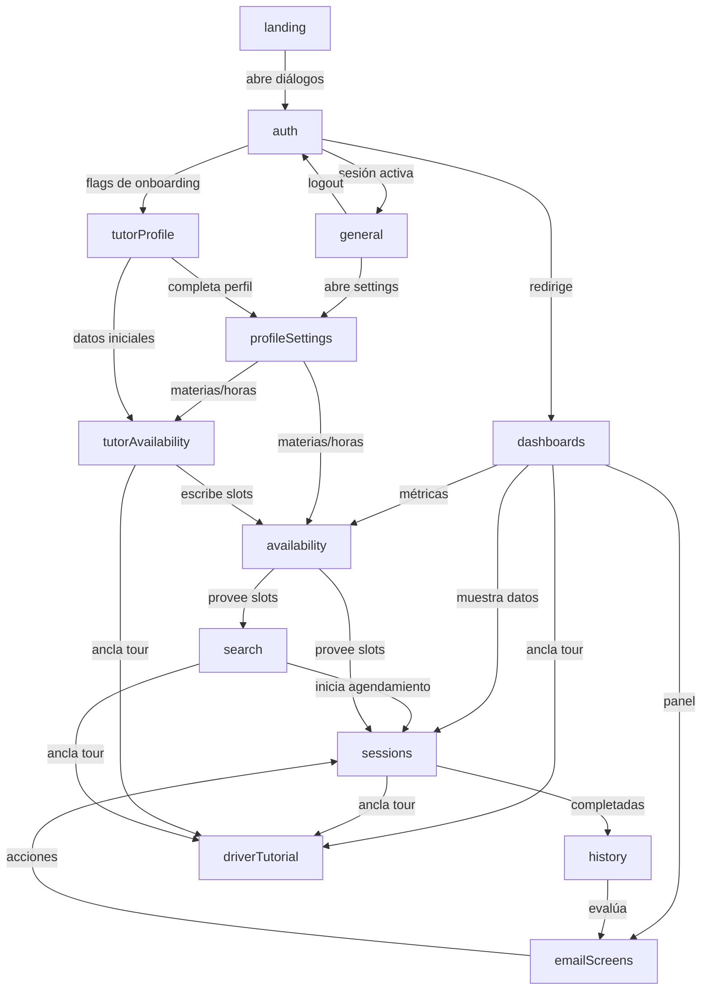

# Índice de Features - Atlas/SGT-Frontend

Este directorio agrupa la documentación técnica de cada feature del proyecto. Cada subcarpeta dentro de `src/features/` contiene su propio `docs/README.md` con detalles específicos.

## Features documentadas

| Feature | Descripción rápida | Documentación |
|---|---|---|
| `auth` | Autenticación, registro, sesión, recuperación y cambio de contraseña. | [auth/docs/README.md](../auth/docs/README.md) |
| `availability` | Lectura de disponibilidad de tutores (slots, información pública). | [availability/docs/README.md](../availability/docs/README.md) |
| `dashboards` | Panel de control para estudiantes y tutores con métricas y notificaciones. | [dashboards/docs/README.md](../dashboards/docs/README.md) |
| `driverTutorial` | Tour de onboarding guiado por rol (estudiante/tutor) basado en driver.js. | [driverTutorial/docs/README.md](../driverTutorial/docs/README.md) |
| `emailScreens` | Acciones iniciadas desde emails (confirmar, evaluar, reprogramar, reset password). | [emailScreens/docs/README.md](../emailScreens/docs/README.md) |
| `general` | Componentes transversales como el menú de usuario. | [general/docs/README.md](../general/docs/README.md) |
| `history` | Historial de sesiones completadas/canceladas con filtros y evaluaciones. | [history/docs/README.md](../history/docs/README.md) |
| `landing` | Página de inicio pública y contenido de marketing. | [landing/docs/README.md](../landing/docs/README.md) |
| `profileSettings` | Configuración de perfil de estudiante y tutor. | [profileSettings/docs/README.md](../profileSettings/docs/README.md) |
| `search` | Buscador y filtro de tutores disponibles. | [search/docs/README.md](../search/docs/README.md) |
| `sessions` | Ciclo de vida completo de sesiones (crear, confirmar, modificar, cancelar, completar). | [sessions/docs/README.md](../sessions/docs/README.md) |
| `studentProfile` | Datos adicionales específicos del perfil de estudiante. | [studentProfile/docs/README.md](../studentProfile/docs/README.md) |
| `tutorAvailability` | Gestión visual de disponibilidad por parte del tutor. | [tutorAvailability/docs/README.md](../tutorAvailability/docs/README.md) |
| `tutorProfile` | Onboarding y gestión del perfil de tutor. | [tutorProfile/docs/README.md](../tutorProfile/docs/README.md) |
| `underConstruction` | Pantalla placeholder para funcionalidades en desarrollo. | [underConstruction/docs/README.md](../underConstruction/docs/README.md) |

## Mapa de relaciones entre features

## Convenciones de documentación

Cada `README.md` de feature sigue una estructura consistente:

1. **Propósito y objetivo**: qué hace la feature y por qué existe.
2. **Problema que resuelve**: necesidad de negocio o técnica.
3. **Componentes principales**: lista con rutas relativas y descripción.
4. **Servicios y APIs**: endpoints consumidos, DTOs y funciones clave.
5. **Utilidades**: helpers, constantes y mappers.
6. **Tipos**: definiciones de TypeScript relevantes.
7. **Stores globales**: estado de Zustand que consume o actualiza.
8. **Flujos de usuario**: paso a paso de los casos de uso principales.
9. **Relación con otras features**: dependencias e integraciones.
10. **Páginas Astro que la utilizan**: dónde se renderiza.
11. **Notas técnicas**: decisiones de arquitectura, SSR vs. cliente, etc.

## Cómo mantener esta documentación

- Cuando se agregue un nuevo componente, servicio o endpoint relevante, actualizar el `README.md` de la feature correspondiente.
- Cuando una feature cambie de dependencias, actualizar la sección "Relación con otras features".
- Para cambios globales, actualizar este índice y el diagrama de relaciones.
